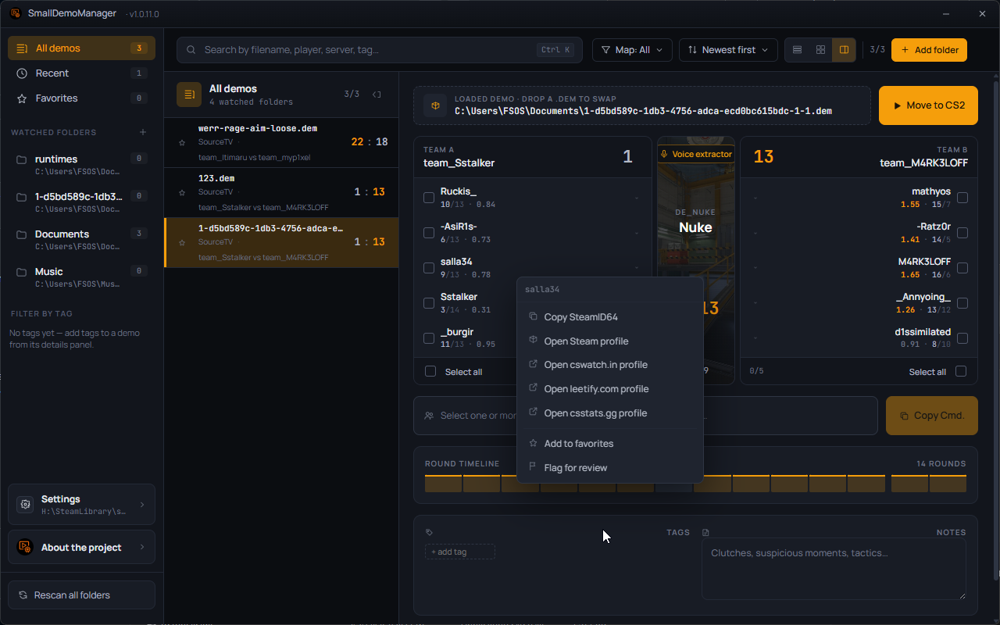

# 🎧 Small Demo Manager 

This is a new version of the "[CS2-SourceTV-Demo-Voice-Calculator](https://github.com/pythaeusone/CS2-SourceTV-Demo-Voice-Calculator)"

---

> [!IMPORTANT]
> It often happens that Valve changes the demo structure with a CS2 update.
> 
> The parser then needs to be updated, and updates take over three days to be released in the MS Store.

---

## ⚙️ Runtime Requirements

This application requires the **.NET 9.0 Runtime** to be installed on your system.  
➡️ [Download .NET 9.0 Runtime (Microsoft)](https://dotnet.microsoft.com/en-us/download/dotnet/9.0)

If the application does not start, make sure this runtime is installed.

---

## 🙏 Special Thanks

Huge thanks to the following awesome people for testing and feedback:
- **KEROVSKI**
- **Throw from cswatch.in Discord**
- and everyone else :)

---

## 🔗 Project and Community Links

- **GitHub project**: [https://github.com/pythaeusone/Small-Demo-Manager](https://github.com/pythaeusone/Small-Demo-Manager)

### 🎮 Community

- **Kerovski Discord**: [https://discord.gg/n26tH9565K](https://discord.gg/n26tH9565K)
- **@KEROVSKI's Tool Video**: [https://www.youtube.com/watch?v=7vsrbD3xBwM](https://www.youtube.com/watch?v=7vsrbD3xBwM)

- **My Steam**: [https://steamcommunity.com/id/pythaeus/](https://steamcommunity.com/id/pythaeus/)

---

## 📦 Used Libraries

- [DemoFile](https://www.nuget.org/packages/DemoFile/)- 
- [DemoFile.Game.Cs](https://www.nuget.org/packages/DemoFile.Game.Cs)
- [Concentus](https://www.nuget.org/packages/Concentus)
- [NAudio](https://www.nuget.org/packages/NAudio)
- [WindowsAPICodePackCore](https://www.nuget.org/packages/WindowsAPICodePackCore)
- [WindowsAPICodePackShell](https://www.nuget.org/packages/WindowsAPICodePackShell)
- [ReaLTaiizor](https://www.nuget.org/packages/ReaLTaiizor)

### 🔁 Transitive Dependencies

- [Google.Protobuf](https://www.nuget.org/packages/Google.Protobuf)  
- [protobuf-net](https://www.nuget.org/packages/protobuf-net)  
- [protobuf-net.Core](https://www.nuget.org/packages/protobuf-net.Core)  
- [Snappier](https://www.nuget.org/packages/Snappier)  
- [System.Collections.Immutable](https://www.nuget.org/packages/System.Collections.Immutable)
- All Transitive parts from NAudio.

---

## 📅 ToDo List

Here's what's next for the project:

- Audio Voice Extractor ✔️
- Audio Voice Player ✔️
- New GUI Design ✔️
- Clean up code ✔️
- Match-Results ✔️
- Custom Name function ✔️
- New Parser ⏳
- Full Match-Details ⏳
- Find the match lobby using the demo ⏳
- Video GUIDE ⏳

---

> "This software is provided under the MIT License. Commercial use is strictly prohibited."
